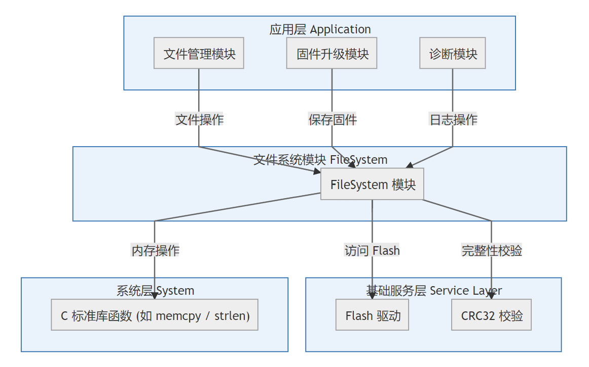
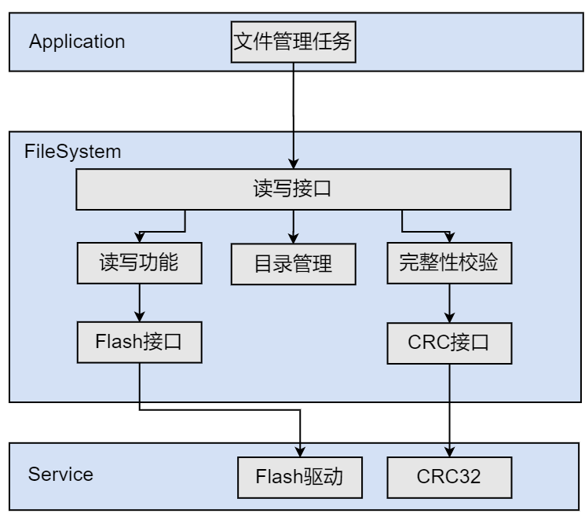

# FileMan 软件设计文档

## 1. 引言

### 1.1 目的

本文件旨在详细说明文件管理模块（FileSystem）的设计与实现方法，包括其功能需求、接口定义、数据结构、状态行为及其与其他模块之间的交互。

### 1.2 范围

FileSystem 模块负责在嵌入式系统中实现简易文件系统功能，包括文件的添加、读取、删除、目录、格式化、CRC 校验等，供上层调用进行管理。

### 1.3 缩略词和术语

| 缩略词    | 含义                              |
| ------ | ------------------------------- |
| CRC    | Cyclic Redundancy Check，循环冗余校验  |
| Flash  | 闪存存储器                           |


## 2. 模块概览

### 2.1 功能描述

FileSystem 是一套轻量级文件管理模块，提供如下功能：
* 初始化存储介质和目录；
* 文件读写：支持文件的读取和写入操作；
* 文件删除：支持删除指定文件；
* 目录下载：支持下载目录内容；
* 文件格式化：支持格式化存储介质；
* 文件覆盖：支持覆盖指定文件。

### 2.2 模块边界与依赖
* FileSystem作为嵌入式系统中的关键存储管理单元，主要负责管理文件的存储、读取、写入和删除等操作。
* 定义了对外提供的接口函数和内部数据结构，方便上层应用进行文件相关操作。
* 文件系统模块依赖于底层的Flash驱动模块来完成对物理存储器的读写和擦除操作；依赖CRC32校验模块确保数据的完整性和可靠性；并使用系统层的标准库函数（如memcpy、strlen等）进行内存和字符串操作


### 2.3 软件结构图


---

## 3. 接口设计

### 3.1 外部接口

| 函数名                              | 输入              | 输出    | 返回值  | 描述       |
| -------------------------------- | --------------- | ----- | ---- | -------- |
| FileSystem_Init           | void            | void  | void | 文件系统初始化，包括初始化存储介质，初始化缓存区和目录三部分  |
| FileSystem_ReadFileGeneral      | 缓存区，文件名        | 读取缓存区     | 状态码  |读取文件     |
| FileSystem_WriteFileGeneral     |缓存区, 文件名，文件长度，是否为最后一包数据       | 无 | 状态码  | 写文件   |
---
### 3.2 内部接口
| 函数名                              | 输入参数                                             | 输出         | 返回值   | 描述                                 |
| ----------------------------------- | --------------------------------------------------- | ------------ | -------- | ------------------------------------ |
| FileSystem_initDirectory            | void                                                | 无           | void     | 初始化文件目录结构体                |
| FileSystem_initDisk                 | void                                                | 无           | void     | 初始化文件存储区        |
| FileSystem_AddFileToDirectory      | char *pFileName, uint16_t nameSize                 | 无           | uint16_t | 将文件添加到目录中                  |
| FileSystem_ReadFileData     | char *pFileName, uint16_t nameSize, uint8_t *OutBuf | 文件数据首包 | uint16_t | 读取文件一页内容                |
| FileSystem_WtireFileData           | uint16_t WriteBlock, uint16_t Size, char *FileName, uint8_t *WriteBuf | 无 | uint16_t | 向指定文件写入一页数据                  |
| FileSystem_DelFileData             | uint16_t FileIndex                                 | 无           | uint8_t  | 删除指定索引的文件                  |
| FileSystem_GetFileCRC              | uint16_t FileIndex                                 | CRC值        | uint32_t | 获取指定文件的CRC校验值             |
| FileSystem_GetFileSize             | uint16_t FileIndex                                 | 文件大小     | uint32_t * | 获取指定文件的存储位置                  |
| FileSystem_FileNameCheck           | char *pFileName, uint16_t nameSize                 | 无           | uint16_t | 检查文件名是否存在                  |
| FileSystem_SearchMatchSectorMapping         | FILEMAN_SECTOR_DIRECTORY_t *dir, uint16_t serchNo  | 扇区编号     | uint32_t * | 查找匹配页面编号                    |
| FileSystem_GetSumSectors           | FILEMAN_SECTOR_DIRECTORY_t *dir                    | 扇区数       | uint16_t | 获取已占用的总扇区数                |
| FileSystem_clrFile                 | void                                                | 无           | void     | 清除临时文件缓冲区等                |
| FileSystem_AddaFileINDirEnd        | char *pFileName, uint16_t FileIndex, uint32_t FileSize, char *OutBuf | 目录写入数据 | void | 将文件信息添加到目录尾部            |
| FileSystem_UpdateTotalFreeINDirectory | char *OutBuf                                    | 无           | void     | 更新目录中的总剩余空间信息          |
| FileSystem_listFiles               | char *OutBuf                                       | 文件列表数据 | void     | 生成目录到缓存                    |


### 3.2 错误码

```c
能否直接参考FOE错误码
```

---

## 4. 数据结构设计

### 4.1 文件系统配置结构体

```c
typedef struct {
    uint32_t FILESYS_MAX_FILE_NUMB;
    uint32_t FILESYS_MAX_FILE_SIZE;
    uint32_t FILESYS_DIR_SIZE;
    uint32_t FILESYS_PAGE_NUMB;
    uint32_t FILESYS_PAGE_SIZE;
    uint32_t FILESYS_MAX_FILE_VOL;
    uint32_t FILESYS_MAX_FILENAME_SIZE;
    uint32_t FLASH_SECTOR_SIZE;
    uint32_t FLASH_MIN_AVAIL_VOL;
} FILESYS_CFG_t;
```

### 4.2 文件信息结构体

```c
typedef struct {
    char FileName[32];
    uint32_t FilePage_mapping[3];
    uint32_t FileSize;
    uint32_t FileCRC;
    
} FILESYS_FILEINFO_t;
```

### 4.3 目录结构体

```c
typedef struct {
    uint32_t TotlaFileNums;
    uint32_t TotlaOcuppySectors;
    uint16_t SectorTable[62];
    uint16_t Payload[...];
    uint32_t DirectoryCRC32;
    uint32-t FullFilePageMapping[...]
} FILESYS_SECTOR_DIRECTORY_t;
```

### 4.4 动态变量结构体

```c
typedef struct {
    uint32_t readSize;
    uint32_t readFileRemainderSize;
    uint32_t readFileAddress;
    uint16_t readFileIndex;
    uint32_t prevReadOffset;
    uint32_t fileCRC;
    uint16_t writeFileIndex;
    uint32_t writeFileOffset;
    uint32_t writeFileSize;
    uint16_t writeFileSector;
} FILESYS_VAR_t;
```
### 4.5 存储介质配置结构体
```c
typedef struct{
    uint32_t StartAddress;
    uint32_t EndAddress;
    int  (*flash_write)(uint32_t addr, const uint8_t *data, uint32_t len);
    int  (*flash_read)(uint32_t addr, uint8_t *buf, uint32_t len);
    int  (*flash_init)(void);
    int  (*flash_eraser)(uint32_t addr, uint32_t len);
}FILESYS_FLASH_CFG_t
```
---

## 5. 模块行为

### 5.1 状态流程图

```text
[INIT] -> [CHECK DIRECTORY] -> [WAIT COMMAND] -> [READ/WRITE/DEL] -> [UPDATE DIRECTORY] -> [IDLE]
```

### 5.2 文件添加流程

1. 检查文件是否存在
2. 在目录中分配空余扇区，更新目录
3. 逐包写入数据到存储介质


### 5.3 文件读取流程

1. 前置操作：初始化目录
2. 检查文件是否存在，检查是否为特殊指令（以dir指令为例）
3. 若为dir，生成目录；若为普通文件，获取第一包文件
4. 逐包获取数据到缓存区

读功能时序图


### 5.4 错误处理策略

* Flash 读/写失败：//待补充
* 目录生成失败：//待补充
* CRC 错误：//待补充

---

## 7. 测试接口说明

### 7.1 测试用例建议

### FileSystem 模块测试用例设计

| 用例编号 | 功能点       | 测试名称               | 输入                           | 预期输出                       | 验证点                                   |
|----------|--------------|------------------------|--------------------------------|--------------------------------|------------------------------------------|
| TC_001   | 初始化       | 初始化文件系统         | 无                             | 初始化成功，目录结构有效       | 返回状态码正确，目录区 CRC 校验通过     |
| TC_002   | 文件写入     | 写入一个新文件         | 文件名、数据缓冲区、长度       | 写入成功，文件可查找           | 文件索引区新增记录，数据写入成功         |
| TC_003   | 文件读取     | 读取刚写入的文件       | 文件名                         | 返回文件数据，数据正确         | 与原始数据一致，可用 CRC 或 memcmp 验证 |
| TC_004   | 文件删除     | 删除已存在文件         | 文件名                         | 删除成功，目录无该文件         | 文件已不存在，目录已更新                 |
| TC_005   | 目录下载     | 读取目录内容           | 无                             | 返回目录结构列表               | 所有文件信息正确                         |
| TC_006   | 文件覆盖     | 重写已有文件内容       | 同名文件、新的数据             | 写入成功，新数据替换旧数据     | 原文件被覆盖，数据一致                   |
| TC_007   | 写入失败处理 | 写入超出最大长度的文件 | 超长数据                       | 写入失败，返回错误码           | 返回错误状态码，目录未发生变化           |
| TC_008   | 格式化       | 格式化文件系统         | 无                             | 所有文件删除，目录清空         | 目录为空，空间释放，索引重置             |
| TC_009   | 异常恢复     | 写入中断后重新初始化   | 模拟异常中断，重新初始化       | 系统恢复，文件状态一致         | 目录未损坏，已有文件完整或被清除         |
| TC_010   | 边界测试     | 写入文件至最大容量     | 填满所有可用空间               | 最后一个文件成功写入           | 总写入大小等于最大容量                   |
| TC_011   | 文件不存在   | 操作不存在的文件       | 不存在的文件名                 | 返回错误                       | 返回错误码，目录未改动                   |


### 7.2 接口 Mock 建议

* Flash 操作函数建议可使用RAM模拟Flash内容以便单元测试

---

## 8. 附录
附录A
* 
* 《FileMan\_Extern.h》

